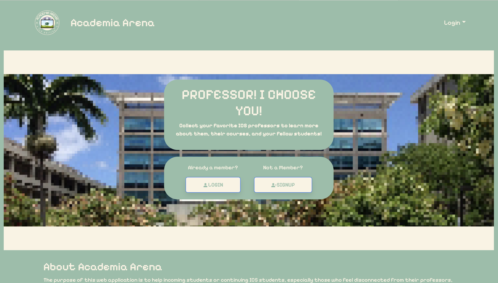

<h1 style="text-align: center;">Academia Arena: ICS Edition</h1>

  

 

## Table of contents

* [Overview](#overview)
* [Deployment](#deployment)
* [Project Goals](#project-goals)
* [What This Project Will Provide](#what-this-project-will-provide)
* [User Guide](#user-guide)
* [Team](#team)
* [Links](#links)

## Overview
The purpose of this web application is to help incoming students or continuing ICS students, especially those who feel disconnected from their professors, connect with them and learn about them more easily. Inspired by trading card games such as [Magic: The Gathering](https://magic.wizards.com/en), [Pokemon](https://www.pokemon.com/us/pokemon-tcg), [Yu-Gi-Oh](https://www.yugioh-card.com/en/), Academia Arena: ICS Edition revolves around collectible cards that contain information about the professors on the UH Manoa campus. The information on the card includes a headshot image, the version of the card (ex: "ICS 314 Spring 2024", "ICS 311 Fall 2023", etc.), fun facts, projects they may have worked on, and the rarity of the card. This platform provides an opportunity for students to meet and interact with others who may have the same class, providing an alleyway to find friends with shared academic interests or professors. 

## Deployment
[Academia Arena: ICS Edition](https://academia-arena.xyz)

## Project Goals
* Learn more about the professors at UH Manoa
* Meet and interact with other students
* Build connections with professors and fellow students within the same major

## What This Project Will Provide 
The goal of this project is to provide a fun and interactive way for students to become more connected with their professors. Much of the information about professors is openly available on any UH department website, but it often is left unseen by the majority of students. By implementing this information into a fun trading card game, students can discover many interesting things about their professors-their projects, particular areas of study, fun facts, interests-which can help boost student-professor interaction during the semester. Ultimately, the hope is that this project will bring students and professors closer, and create a more interactive environment in the classroom. 

## User Guide
This section provides a walkthrough of the Academia Arena interface and its capabilities. As we are still in the planning stages, this section currently consists of mockup pages that we plan on incorporating into our final application.

### Landing Page
The landing page is presented to users when they visit the top-level URL to the site. It provides a general description of our application and gives the user the option to Login, Sign Up, or visit our github page.

  

 

### Login and Sign Up Page
The Login Page allows existing users to input their username and password in order to gain into their accounts. It also provides links for users to reset their username/password, and a link to users who do not have an existing account. The Sign Up Page allows new users to create an account by inputing their desired username, email address, and password. This page also contains links for users who already have an existing account.

  
  

 

### Card Collection Page (Mockup)
The Card Collection Page displays the cards associated with the user currently logged in. These are the cards that this user has obtained through the application. 

  

 

### Admin Page (Mockup)
The Admin Page allows admin users access to view the entire cards collection, add new cards, manage player accounts, and change general settings. The view cards page includes a search bar for admin to easily lookup any card in the database system by name or battle stats.

  

 

### Wishlist Page (Mockup)
The Wishlist Page allows the user to add to a database a list of cards they are hoping to obtain through the random pull system of the app. The user may look through previews of already existing professor cards and "like" the previews to add that card to their wishlist. The wishlist gives the user a way to keep track of the cards, and the professors, they hope to learn more about.

  

 

### Card Pull Page (Mockup)
The Card Pull Page will be the main mechanism for obtaining cards in the app's system. The user will be tasked with solving simple coding problems such as recalling underscore commands to gain points. Once the user gains a certain amount of points they will be able to pull for a professor card. The card obtained will then be automatically added into the user's collection for them to view when they want to learn about their professors or when they want to battle a fellow student.

  
  

 

## Team
Academia Arena is designed, implemented, and maintained by:
* [Erin Patterson](https://erinlpat.github.io)
* [Elsa Wong](https://elsawong1.github.io/)
* [Carlo Viloria](https://carloviloria.github.io/)
* [Michaella Villanueva](https://mvchaella.github.io)
* [Vanessa Nishi](https://vanessanishi.github.io/) 
* [Yu Fang Ma](https://yu-fang-ma.github.io/)

## Links
See our [Team Contract](https://docs.google.com/document/d/1SX2wGUCBZ31Wb7rdrtAn-oDDah1WFSVJwvAtU1mxPSc/edit?usp=sharing) here!

Visit our [Github Organization](https://github.com/academia-arena) here!

Look at our goals for [Milestone 1](https://github.com/orgs/academia-arena/projects/1) at this project page!

Look at our goals for [Milestone 2](https://github.com/orgs/academia-arena/projects/7) at this project page!
