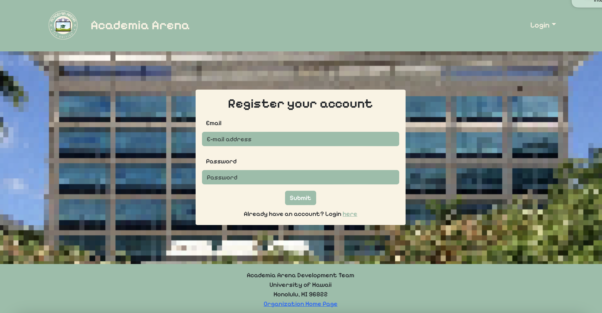

<h1 style="text-align: center;">Academia Arena: ICS Edition</h1>

<div class="text-center" style="display: flex; justify-content: center;">
  
</div>


<br>

## Table of contents

* [Overview](#overview)
* [Activity Badges](#activity-badges)
* [Deployment](#deployment)
* [Project Goals](#project-goals)
* [What This Project Will Provide](#what-this-project-will-provide)
* [User Guide](#user-guide)
* [Developer Guide](#developer-guide)
* [Team](#team)
* [Links](#links)

## Overview
The purpose of this web application is to help incoming students or continuing ICS students, especially those who feel disconnected from their professors, connect with them and learn about them more easily. Inspired by trading card games such as [Magic: The Gathering](https://magic.wizards.com/en), [Pokemon](https://www.pokemon.com/us/pokemon-tcg), [Yu-Gi-Oh](https://www.yugioh-card.com/en/), Academia Arena: ICS Edition revolves around collectible cards that contain information about the professors on the UH Manoa campus. The information on the card includes a headshot image, the version of the card (ex: "ICS 314 Spring 2024", "ICS 311 Fall 2023", etc.), fun facts, projects they may have worked on, and the rarity of the card. This platform provides an opportunity for students to meet and interact with others who may have the same class, providing an alleyway to find friends with shared academic interests or professors. 

## Activity Badges
[](https://github.com/academia-arena/academia-arena/commits/main?icon=github&color=green)

[](https://github.com/academia-arena/academia-arena/actions/workflows/ci.yml)

## Deployment
View our web app here! 

[Academia Arena: ICS Edition](https://academia-arena.xyz)

## Project Goals
* Learn more about the professors at UH Manoa
* Meet and interact with other students
* Build connections with professors and fellow students within the same major

## What This Project Will Provide 
The goal of this project is to provide a fun and interactive way for students to become more connected with their professors. Much of the information about professors is openly available on any UH department website, but it often is left unseen by the majority of students. By implementing this information into a fun trading card game, students can discover many interesting things about their professors-their projects, particular areas of study, fun facts, interests-which can help boost student-professor interaction during the semester. Ultimately, the hope is that this project will bring students and professors closer, and create a more interactive environment in the classroom. 

## User Guide
This section provides a walkthrough of the Academia Arena interface and its capabilities. As we are still in the planning stages, this section currently consists of mockup pages that we plan on incorporating into our final application.

### Landing Page
The landing page is presented to users when they visit the top-level URL to the site. It provides a general description of our application and gives the user the option to Login, Sign Up, or visit our github page.
<div class="text-center">
  
</div>
<br>

### Home Page
The Home Page is the page the users will be greeted with after logging in. It allows users access to the full range of the app's functions and has visual decorations.
<div class="text-center">
  
</div>
<br>

### Login and Sign Up Page
The Login Page allows existing users to input their username and password in order to gain into their accounts. It also provides links for users to reset their username/password, and a link to users who do not have an existing account. The Sign Up Page allows new users to create an account by inputing their desired username, email address, and password. This page also contains links for users who already have an existing account.
<div class="text-center p-4">
  
  
</div>
<br>

### Card Collection Page
The Card Collection Page displays the cards associated with the user currently logged in. These are the cards that this user has obtained through the application. 
<div class="text-center">
  
</div>
<br>

### Admin Page
The Admin Page allows admin users access to view the entire cards collection, add new cards, manage player accounts, and change general settings. The view cards page includes a search bar for admin to easily lookup any card in the database system by name or battle stats.
<div class="text-center">
  
</div>
<br>

### Wishlist Page
The Wishlist Page allows the user to add to a database a list of cards they are hoping to obtain through the random pull system of the app. The user may look through previews of already existing professor cards and "like" the previews to add that card to their wishlist. The wishlist gives the user a way to keep track of the cards, and the professors, they hope to learn more about.
<div class="text-center">
  
</div>
<br>

### Card Pull Page
The Card Pull Page will be the main mechanism for obtaining cards in the app's system. The user will be tasked with solving simple coding problems such as recalling underscore commands to gain points. Once the user gains a certain amount of points they will be able to pull for a professor card. The card obtained will then be automatically added into the user's collection for them to view when they want to learn about their professors or when they want to battle a fellow student.
<div class="text-center">
  
</div>
<br>

### Marketplace
The Marketplace page allows users to trade cards with other users. Users may post cards that belong to their own collection to the Marketplace for any other user to obtain and browse other users' posted cards to obtain for themselves.
<div class="text-center">
  
  
</div>
<br>

## Developer Guide
A walkthrough of how to download, install, run and modify this program. 

1. Install Meteor ([see the latest installation instructions here](https://docs.meteor.com/install.html))
2. Download a copy of the [academia-arena template](https://github.com/academia-arena/academia-arena)
    - Click on the 'Use this template' button
      
    - Select 'Create a new repository'
      
    - Then clone this repository your local device and open with your chosen software editor.
3. Install the Meteor libraries:
    - cd into the app directory
    - Run the command:
         ```
         $ meteor npm install
         ```
4. Run the program with the command:
     ```
     $ meteor npm run start
     ```
     - Upon the initial run, you should see the default data being added.
6. Check for ESLint errors with:
     ```
     $ meteor npm run lint
     ```

## Community Feedback
The Academia Arena team is dedicated to making our app as functional (and fun) as possible! If you have any feedback to give us please feel free to contact us through this [form](https://forms.gle/MKh4uVdgyiN1KYtX7).

Here are some reviews from UH Manoa community members who have used our app and given us feedback:

*I loved the design and function of the app, the pixel game aesthetic was super effective! The functionality of the app could be different based on if people want to use it primarily to collect cards/learn about their professors or to use it as a form of studying/for the card pull game. If I was a CS student and this had more questions on it I would definitely use it as a fun study tool.* - Alumni, Class of 2023

*The app does seem somewhat interesting if you have the chance to trade and get different cards. I would probably add like an actual battling system especially since each card has its own power rating and they carry abilities. Also as mentioned before I would probably add like a currency to which you can buy cards from the marketplace without pulling. I would also create different questions more on the multiple choice side and if the topic could be anything, I would probably go for questions and topics that would be more in the field of general knowledge so it can be played by everyone of all age.* - Alumni, Class of 2024

*I really like the design and it's very easy to navigate around and use. I think the font is a little confusing to read sometimes, for example the Cs can look a lot like 0 or O. I think it seems fun to use, especially if enough people use it to create a thriving card marketplace. Maybe there could be a more thorough "about" page that explains a little more about how to use the app and what the app is for. Like a guide for the site so that people who aren't familiar with pokemon can understand what is going on because I was a little confused when I first started but I'm not a big nerd so maybe that's just me.* - Alumni, Class of 2023

*Needs more content and maybe a more readable font (almost mistook the 200 for a 400) but it works in the aesthetic it goes for. Otherwise a fine program, found no issues when I used it.* - Undergraduate, Class of 2026

*As I am not in ICS, I was amazed by this project and its features. It is really cool that you can achieve this level of webpage and game design as undergrad cs students! It functioned perfectly well, and every button and action performed as I expected. My favorite thing of the project, by far, was the concept. The idea of a card-collection game was very cute and can be seen through all the pages, especially through the font, card details, and bit-images. When I was first logged in, I enjoyed exploring the different pages and functions. All my suggestions are in the previous comments.* - Undergraduate, Class of 2026

If you are interested in seeing the full scope of the feedback we received, please view this [document](https://docs.google.com/spreadsheets/d/1kSnLrQtCBji3PsPfpSKckE-bG4KRV8ofUYv493g9N2o/edit?usp=sharing)!

## Future Plans
The Academia Arena team plans to make use of the valuable feedback of our users and mentors as we receive it. Here are some of our future plans based on our own goals as well as the feedback we have received:

* Make a tutorial page for new users and players that are not familiar with trading card games.
* Add more questions to our card pull game quiz.
* Add an in-game currency and a way to earn it that allows users to buy cards instead of trading or pulling for them.
* Develop a more complex trading system where users may send offers to swap cards with each other back and forth rather than just listing and obtaining cards.

## Team
Academia Arena is designed, implemented, and maintained by:<br />
<table style="border: none;">
  <tr>
    <td style="border: none; border-bottom: none; text-align: center;"><a href="https://erinlpat.github.io"><br /><sub><b>Erin Patterson</b></sub></a></td>
    <td style="border: none; border-bottom: none; text-align: center;"><a href="https://elsawong1.github.io/"><br /><sub><b>Elsa Wong</b></sub></a></td>
    <td style="border: none; border-bottom: none; text-align: center;"><a href="https://carloviloria.github.io/"><br /><sub><b>Carlo Viloria</b></sub></a></td>
  </tr>
  <tr>
    <td style="border: none; border-bottom: none; text-align: center;"><a href="https://mvchaella.github.io"><br /><sub><b>Michaella Villanueva</b></sub></a></td>
    <td style="border: none; border-bottom: none; text-align: center;"><a href="https://vanessanishi.github.io/"><br /><sub><b>Vanessa Nishi</b></sub></a></td>
    <td style="border: none; border-bottom: none; text-align: center;"><a href="https://yu-fang-ma.github.io/"><br /><sub><b>Yu Fang Ma</b></sub></a></td>
  </tr>
</table>


## Links
See our [Team Contract](https://docs.google.com/document/d/1SX2wGUCBZ31Wb7rdrtAn-oDDah1WFSVJwvAtU1mxPSc/edit?usp=sharing) here!

Visit our [Github Organization](https://github.com/academia-arena) here!

Look at our goals for [Milestone 1](https://github.com/orgs/academia-arena/projects/1) at this project page!

Look at our goals for [Milestone 2](https://github.com/orgs/academia-arena/projects/7) at this project page!

Look at our goals for [Milestone 3](https://github.com/orgs/academia-arena/projects/9) at this project page!

